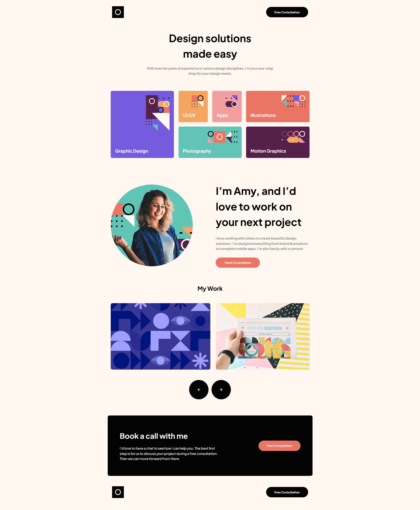
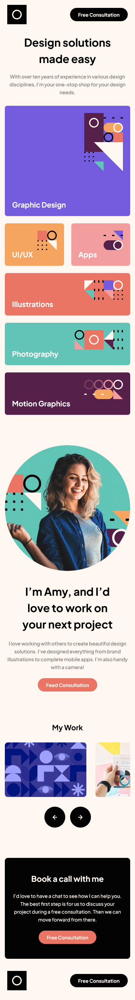

# Frontend Mentor - Single-page design portfolio solution

This is a solution to the [Single-page design portfolio challenge on Frontend Mentor](https://www.frontendmentor.io/challenges/singlepage-design-portfolio-2MMhyhfKVo).

## Table of contents

- [Frontend Mentor - Single-page design portfolio solution](#frontend-mentor---single-page-design-portfolio-solution)
	- [Table of contents](#table-of-contents)
	- [Overview](#overview)
		- [The challenge](#the-challenge)
		- [Screenshot](#screenshot)
		- [Links](#links)
		- [Built with](#built-with)
		- [What I learned](#what-i-learned)
	- [Author](#author)

**Note: Delete this note and update the table of contents based on what sections you keep.**

## Overview

### The challenge

Users should be able to:

- View the optimal layout for the site depending on their device's screen size
- See hover states for all interactive elements on the page
- Navigate the slider using either their mouse/trackpad or keyboard

### Screenshot

### Links

- Solution URL: [Fontend Mentor](https://www.frontendmentor.io/solutions/single-page-design-portfolio-nextjs-tailwind-css-2yEmcMG_l9)
- Live Site URL: [Site](https://designportfolio-mt.netlify.app/)

### Built with

- [React](https://reactjs.org/) - JS library
- [Next.js](https://nextjs.org/) - React framework
- [Tailwind CSS](https://styled-components.com/) - CSS framework 
- [Swiper.js](https://swiperjs.com/) - Swiper Library

**Note: These are just examples. Delete this note and replace the list above with your own choices**

### What I learned

Learning how to setup next.js project with tailwind css.
Writing a fluid scaling custom plugin.

## Author

- Website - [Mondara](https://mondarathotage.com/)
- Linkedin - [@Mondara](https://www.linkedin.com/in/mondara-thotage/)
- Github - [@Mondara](https://github.com/Mondara)
